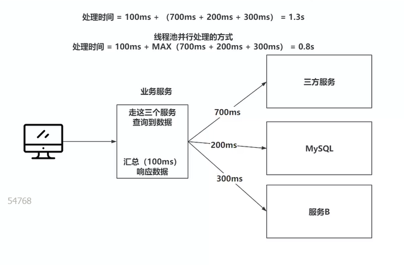
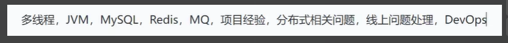

# 并发编程面试 3-线程池面试

>  推荐书籍 -- <并发编程实战> <并发编程的艺术>

## 1、线程池的核心参数【常识】

~~~ java
public ThreadPoolExecutor(int corePoolSize, //核心线程数-懒加载最少有多少个线程等活
                          int maximumPoolSize, //最大线程数-当工作队列满了之后，创建非核心线程处理
                          long keepAliveTime, //最大空闲时间-默认非核心线程，没活之后只能空闲
                          TimeUnit unit, //空闲时间单位
                          BlockingQueue<Runnable> workQueue, //工作队列-当核心线程数足够后，投递的任务会丢到工作队列当中
                          ThreadFactory threadFactory,//线程工厂，线程一定要给予有意义的名字
                          RejectedExecutionHandler handler) //核心数到了，队列满了，非核心数到，再来任务走拒绝策略
~~~

## 2、如何设置线程池的配置

1. 最重要的是 **核心线程数应该写多少** ？

​	考虑 **CPU密集** 还是 **IO密集**

- 当业务是 CPU 密集 [ **业务是使用的大量的计算，一只都是占用 CPU 的**] 一般这种情况下核心线程就设置 CPU 内核数 加减 1，但这个不一定就是最佳的，最终准确的结论还是需要通过压测才可以得出一个合理的数值，可以使用 **jmeter 压测** 。
- 如果是 IO 密集 [**业务设计到大量的查询数据库**]，查询三方获取一些数据，而再查询的数据的时候，线程基本都是处于等待的状态。查询三方服务，或关于数据库的操作，此时你会发现 IO密集的方法好像并没有什么好的公式使用，因此在此情况下你可以先根据 IO密集和 CPU 密集得到一个大致的核心线程数，基于这个数值再进行压测，得到一个较好的效率。

2. **最大线程数**：其实核心线程数已经可以做到尽可能的发挥 CPU 的性能了，所以最大核心线程数最好设置于核心线程数一致。如果在核心线程的基础上，再追加线程又可能会导致性能下降，这样可能会带来更多的不必要的上下文切换消耗。
3. **工作队列**：任务排队的地方，每一个任务都是一个 Runnable 的实现，是一个对象如果该对象初始化的内部资源比较大，要考虑到堆空间的占用，不能让任务压爆 JVM 内存
4. **拒绝策略**：当工作队列满了，如果该任务就是一个日志的记录不重要的，直接丢掉就行，如果是核心业务当中重要的一环，那就扔掉就行，可以把任务留存之后最终一起处理。

> 在压测的过程当中，需要根据实际的情况对一些线程池的参数进行动态的修改，这些修改可以通过 set 方法，当然也可以使用一些第三方的线程池检测开源框架比如美团动态线程池策略团队的 Hippo4j 。

[ 线程池管理工具-Hippo4j 马士兵教育官网 ](https://www.mashibing.com/course/2377) 压测数据对接第三方通知平台 [钉钉，飞书]

## 3、线程池的执行原理

1. 任务到线程池之后，会先看核心线程数到了没，如果没有就构建核心线程去处理这些任务
2. 如果核心线程数到了之后，就会丢到工作队列，登录核心线程任务处理完当前任务之后，继续处理队列任务
3. 当工作队列满了之后，就尝试创建非核心线程去处理队列以外的新任务
4. 如果非核心线程创建失败（到达最大线程数），就会触发拒绝策略

## 4、线程池有那些拒绝策略

- 自定义的拒绝策略，拒绝策列提供了一个接口规范，可以自己去实现，比如将任务进行序列化之后保存到redis当中，结束后统一处理。

~~~ java
public interface RejectedExecutionHandler {
    void rejectedExecution(Runnable r, ThreadPoolExecutor executor);
}
~~~

- 抛出异常

~~~ java
public static class AbortPolicy implements RejectedExecutionHandler {
    public AbortPolicy() { }
    public void rejectedExecution(Runnable r, ThreadPoolExecutor e) {
        throw new RejectedExecutionException("Task " + r.toString() +
                                             " rejected from " +
                                             e.toString());
    }
}
~~~

- 丢弃任务

~~~ java
public static class DiscardPolicy implements RejectedExecutionHandler {
    public DiscardPolicy() { }
    public void rejectedExecution(Runnable r, ThreadPoolExecutor e) {
    }
}
~~~

- 交给任务的投递者

~~~ java
public static class CallerRunsPolicy implements RejectedExecutionHandler {
    public CallerRunsPolicy() { }
    public void rejectedExecution(Runnable r, ThreadPoolExecutor e) {
        if (!e.isShutdown()) {
            r.run();
        }
    }
}
~~~

- 结束最早排队的任务，并加入到队列当中

~~~ java
public static class DiscardOldestPolicy implements RejectedExecutionHandler {
    public DiscardOldestPolicy() { }
    public void rejectedExecution(Runnable r, ThreadPoolExecutor e) {
        if (!e.isShutdown()) {
            e.getQueue().poll();
            e.execute(r);
        }
    }
}
~~~

## 5、线程池里的工作线程于普通线程有什么区别

线程池当中的工作线程的内部封装了一个 Worker 对象，这个 Worker 对象未来适配线程池的逻辑，它实现了 Runnable 存储了第一次要执行的任务。同时还继承了 AQS ,未来满足线程池的 shutdown 和 shutdownNow 的逻辑。

>  shutdown 于 shutdownNow 都是关闭线程池的方法，最终会把工作线程全部干掉。

- **shutdown** : 等待任务队列当中的任务全部处理完毕之后，如果有等待任务的线程，就直接中断，关闭线程池。
- **shutdownNow** : 立即中断正在处理的任务，同时将任务队列当中的任务全部返回，再关闭工作线程。

工作线程再执行任务的时候，会基于 AQS 将 state 设置为 1，代表当前的工作线程正在干活，干完活之后，再将 state 设置为 0 。

shutdown 方法不会中断正在处理任务的线程，所以 shutdown 再中断线程之前都会先检查 state 的状态。

## 6、如果主线程结束了，没有执行 shutdown 线程池，线程池会一直存在吗？

会，因为线程不会回收， run 方法没有结束，线程是 Worker 类， Worker 类是线程池内部类，线程池在，线程就在会导致内存泄漏。

~~~ java
//主线程
public void test(){
	ThreadPoolExecutor executor=new ThreadPoolExecutor();
	//处理一些其他业务
	executor.shutdown();
}
~~~

## 7、如何在线程池执行前挡板追加一些操作？

线程池底层在执行任务函数之前提供了afterExecute  与 beforeExecute 的两个钩子函数，可以继承线程池对这两个方法进行重写，那么以后只要在线程池执行前后，执行这两个函数就行。

## 8、任务饥饿问题

只要是没有执行 shutdownNow ，就必须保证当在工作队列有任务的时候，一定至少有一个工作线程存在（当核心线程被设置为 0 的时候），以保存去处理工作队列中的任务。

## 9、工作线程结束的方式

正常结束就是run方法结束，可以是非核心线程的时间到了，run方法正常结束。也可以是执行任务期间，出现了异常。如果是Runnable的方式提交任务，那工作线程就异常结束，工作线程就没了。
但是如果提交任务的方式是基于Callable走的FutureTask，那执行过程中的异常不会抛出来，工作线程不会结束。

## 10、什么场景线程池

1. 异步处理，比如发送邮箱、发送短信、上传下载文件
2. 定时任务，时间到了之后，触发一个线程去执行某一个任务
3. 访问多个服务，做并行处理的时候 

 

4、处理的数据体量比较大，导入导出，可以让多个线程分片并行去处理

5、框架的底层，比如 RabbitMQ 的消费者端，如果不配置默认单线程。

 

