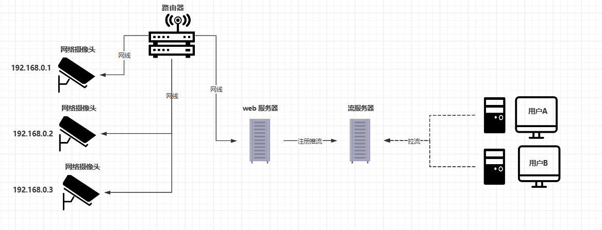
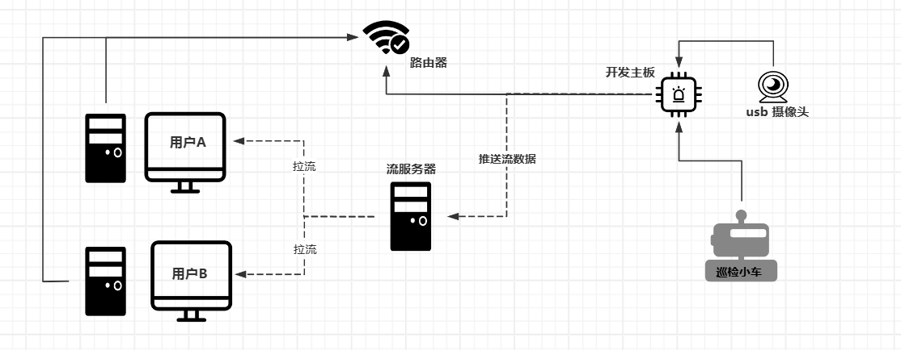
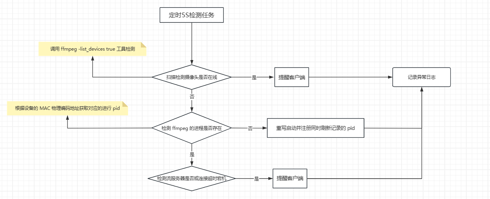

## 开发场景

### 关于摄像头工业大屏的应用

​	之前我们需要给鄂尔多斯场去做一个用于实时检测的数字孪生系统，购进的摄像头有 HD 的高清摄像头与 AI 摄像头，AI 摄像头内置了海康自己的 AI 模块，只需要将我们自己训练的识别模型放到该模块当中就行，HD 高清摄像头主要用于将抓拍的图片进行本地的算法分析，上报最终数据。网络摄像头其实只需要通过推流工具通过 RTSP 的将流数据推送给服务器就行，由于海康威视摄像头默认是 **.H264** / **.H265** 编码，所以再推流的时候无需再进行压缩转码，原生的流数据本身就是很可靠的。海康威视本身自带了 WEB 页面播放视频的插件与 Demo 只需将自带的整合到 Vue 当中进行登录注册就行。

 

​	后续采购了一些 USB 摄像头，用于煤炭巡检小车的安装，由于小车是通过 wifi 模块，4G 模块上的开发板连接的，无法连接到小型工控网络摄像头上的，后面采用 USB 摄像头与开发主板对接，开发主板将采集到的 USB 视频流数据，通过开发版上的 **ffmpge 进行转 .H264 编码** 之后进行流推送到流服务器，WEB 大屏再将推送的流数据拉取到客户端。

 

### 实际落地遇到的瓶颈问题

#### USB 视频推流出现累计延时和长时间连接掉线

当时为了缩小体积，采购了低成本摄像头。在实际的本地开发环境下测试的时候发现视频会随着时间的推移延时会不断的累加，经常出现连接掉线，只要一旦连接到工控巡检车视频页面之后，流量就会飙升，带宽几乎被占用完，后面发现购进的摄像头本身是不自带 H.264 硬编码的，在使用 ffmpage 推流的基础之上进行一次视频压缩转码，转为 H.264 编码推送。

在后续的线上生成环境下，为了减少对于资源本就不多的开发版性能的占用，就统一采购了 H.264 编码规格的摄像头。

#### 输入输出设备增加导致的视频页面卡顿延时问题

由于摄像头连接的流服务器是要提供给多个部门去使用的，在刚开始使用的时候处于测试阶段接入的用户量并不多，注册的检测用户也不多，后续随着接入的硬件与用户数量增加，会出现流服务器页面卡顿的问题。由于使用的 ZLMediaKit 流服务器性能本身是很好的，查看服务端的硬件资源占用率发现带宽经常跑满，者其主要是因为单机部署，由于在拉流的时候接入的用户太多，导致带宽不够，通过扩展了一个额外的 ZLMediaKit 流服务器构建了集群 。

#### 如何保证推流的稳定以及中断重连机制

关于这点其实主要是两方面：

1. 网络中断，比如说摄像头推流怎么能保证在网络突然中断，又突然连接这种情况下保证继续推流呢？主要是分为推流端中断和流服务器中断以及拉流端中断。

   **推流端中断**（摄像头掉线、进程崩溃、网络故障），**拉流端中断**（播放器断开、解码失败）

   - 推流端

   

   - 拉流端比较简单，只要是播放器断开，流服务器在长时间未检测到拉流数据就会自动的关闭该流输出。若是拉流失败设置自动重连机制超过5次之后，默认将异常信息提醒到客户端。