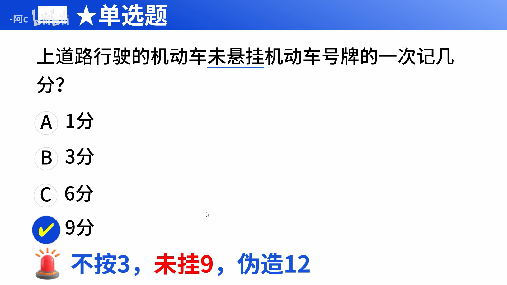
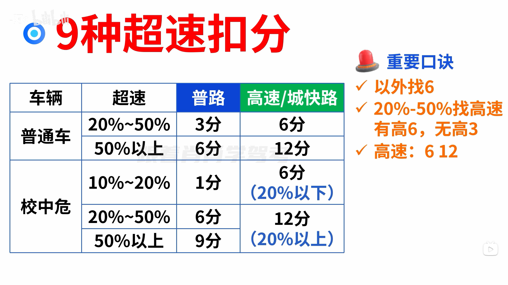
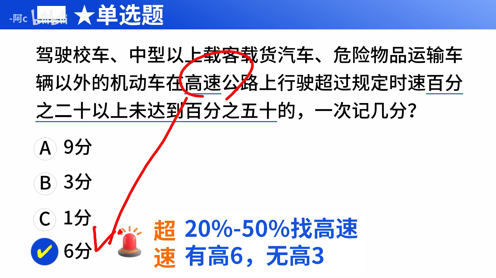
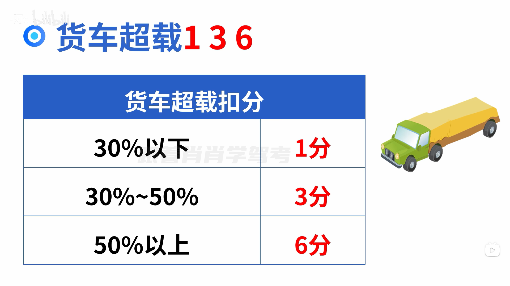

# 科目一 3小时精髓课【上篇】

[科目一3小时精髓课【2025年1月持续更新】_哔哩哔哩_bilibili](https://www.bilibili.com/video/BV1Vj411t7ri/?spm_id_from=333.337.search-card.all.click&vd_source=3d9e87bffd7b6715a497ed657c5950bc)

## 第一节

 

  

 ## 违规行为扣几分

### 1 分关键字

 

 

 

 

### 3 分关键字

 

 

  

   

### 6 分关键字

 

   

  

  

### 9 分关键字

 

   

 

  

### 12 分关键字

 

 

  

 

 

### 号牌扣分 3 9 12

 

 

 

 

### 9种超速扣分

  

 

 

### 7种超员扣分总结

 

   

 

  

  

### 货车超载 1 3 6

  

 

## 罚款

### 200 一下找车相关

 

 

 

  

 

 

### 20- 200 的关键词

 

 

 

### 200 - 500 的关键词

 

 

 

### 200-2000 的关键词

  

 

### 500 、2000 罚款关键词

 

 

 

 

 

### 审验相关处罚

  

 

 

 

### 代记分 三五倍

 

 

 

 

 

### 酒驾罚多少

 